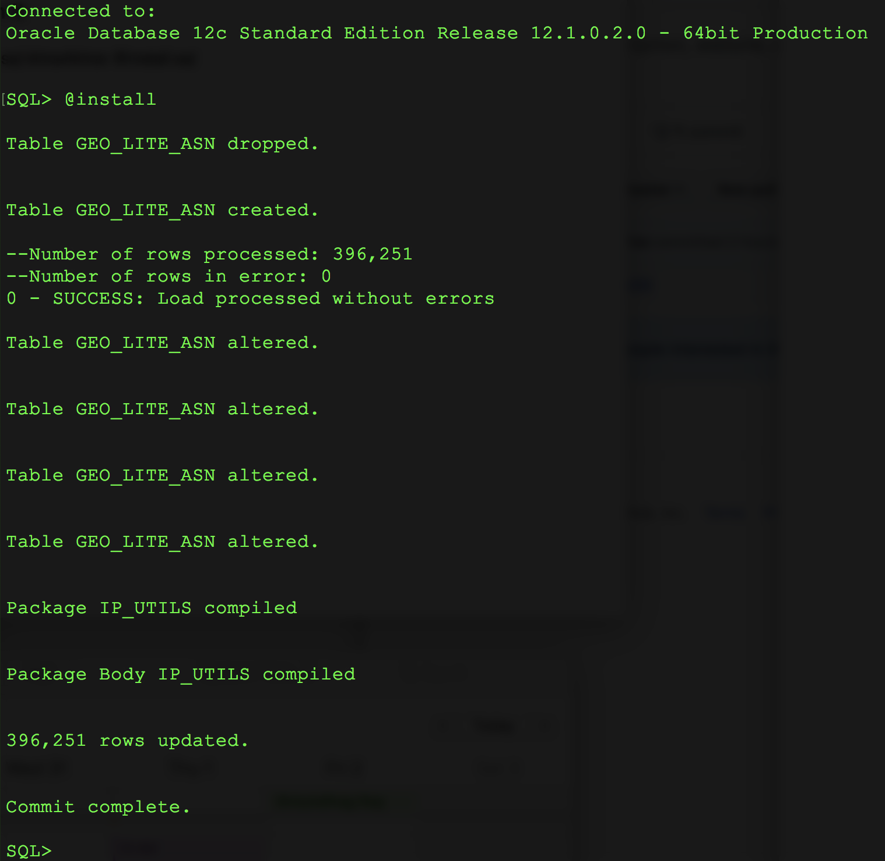

# maxmind-oracle


This is a set of scripts to load GeoLite ASN CSV from [MaxMind](https://twitter.com/maxmind). The details of the file can be found [here](https://dev.maxmind.com/geoip/geoip2/geolite2/).

These scripts create a table and utilites to get the ownership of an ip address.  

###TODOS

- automate download/load the csv
- add IPv6
 

## Install Steps

### Downloads

- GeoLite ASN	unpack from : https://dev.maxmind.com/geoip/geoip2/geolite2/
- SQLcl from : http://www.oracle.com/technetwork/developer-tools/sqlcl/overview/index.html

### Edits
 
- Edit install.sql
- Adjust the path to the csv

 

### Run it
- sql USERNAME/PASSWORD @install.sql



## PL/SQL Package IPUTILS
This is a small package to help in resolving an IPv4 Address to it's number  and back

```
create or replace package ip_utils as

  -- Convert an IPv4 to a number
  -- Ex: ip_utils.ip2num('192.168.1.1')
  --    Returns : 3232235777
  function ip2num (p_ip varchar2) return number;
  
  -- convert a number back to the ip address
  -- Ex: ip_utils.num2ip(3232235777)
  --    Returns: 192.168.1.1    
  function num2ip  (p_num number) return varchar2;
  
  -- returns the highest ip address in a CIDR block
  -- Ex: ip_utils.maxip_in_cidr('192.168.1.1/24')
  --    Returns: 192.168.1.255 
  function maxip_in_cidr (p_cidr varchar2) return varchar2;
  
  -- returns the highest ip number in a CIDR block
  -- Ex: ip_utils.maxnum_in_cidr('192.168.1.1/24')
  --    Returns: 3232236031  
  function maxnum_in_cidr (p_cidr varchar2) return number;
  
 end;
 /

```

Here's the package in use:

```
SQL>   select ip_utils.ip2num('192.168.1.1') ip_number , 
           ip_utils.num2ip(3232235777) ip_address ,  
           ip_utils.maxip_in_cidr('192.168.1.1/24') max_in_cidr , 
           ip_utils.maxnum_in_cidr('192.168.1.1/24') max_in_cidr_number 
   from dual;

   IP_NUMBER   IP_ADDRESS    MAX_IN_CIDR       MAX_IN_CIDR_NUMBER 
  __________   ___________   _____________     __________________
  3232235777   192.168.1.1   192.168.1.255             3232236031 

```

## Usage

A simple lookup into the GEO\_LITE\_ASN table by ip number in the range.

```
SQL> select * 
  2  from   geo_lite_asn 
  3  where ip_utils.ip2num('8.8.8.8')  between low_num and high_num;
  
NETWORK        AUTONOMOUS_SYSTEM_NUMBER AUTONOMOUS_SYSTEM_ORGANIZATION       LOW_NUM    HIGH_NUM 
__________     ________________________ ______________________________     _________   _________
8.8.8.0/24                        15169 Google LLC                         134744064   134744318 


```


